# Pharmacy Inventory Management System

A console-based Pharmacy Inventory Management System developed in **C** using structured programming and file handling (.dat files).

Built as a Software Development Project (SDP) at **Bangladesh University of Business and Technology (BUBT)**, Department of Computer Science and Engineering.

> ✅ **Project Status:** All planned features complete — Login System, Medicine Management, Inventory Management, Sales Management, and Reports are fully implemented and tested. Selected to represent the class at the Software Development Idea Pitching & Project Showcasing, BUBT (18 August 2026).

---

## 👥 Team — Three Knights

| Student ID  | Name                | Role                          | Key Responsibilities
| ----------- | ------------------- | ------------------------------ | ------------------------------ | 
| 20254103279 | [Makhzum-Bin-Harun](makhzumbinharun.github.io)   | Team Leader & Core Programmer | Team coordination, system architecture design, Login module implementation, module integration and documentation | 
| 20254103269 | [MD. Rafiul Islam](www.linkedin.com/in/therafiulislam)    | Core Programmer & SQA         | Medicine Management module, file handling design, unit testing, test case documentation, bug tracking | 
| 20254103272 | Estiak Ahmed Turnab | Core Programmer               | Sales module, Inventory and stock tracking module, Reports module | 


**Supervised by:** [Mastura Sadaf](www.linkedin.com/in/mastura-sadaf-742588137), Lecturer, Dept. of CSE, BUBT

---

## 📋 Project Overview

This system helps small pharmacies manage their daily operations through a role-based console interface. It supports two user roles — **Admin** and **Staff** — each with different levels of access, backed entirely by binary file storage with no external database.

---

## ✅ Features

- **Login System** — File-based authentication with an interactive first-run setup (no hardcoded credentials); Admin can register additional Staff accounts
- **Medicine Management** — Add, view, search, update, and delete medicine records, including brand name, generic name, category, price, and quantity. Supports searching and selecting records by ID *or* partial name, with duplicate-ID protection
- **Inventory Tracking** — Real-time stock tracking with automatic low-stock alerts (below 10 units)
- **Sales Management** — Sell medicine with automatic stock deduction, stock-availability validation, and auto-generated sequential Transaction IDs (`TXN001`, `TXN002`, ...)
- **Reports** — Inventory Report, Sales History Report (with running totals), and Low Stock Report
- **Role-based access** — Staff actions that modify data require Admin password confirmation
- **Polished console UI** — Centered banners, clean screen transitions between menus, and consistent formatting throughout

---

## 🔐 Role-Based Access

| Feature          | Admin | Staff                      |
| ----------------- | ----- | --------------------------- |
| Login             | ✅    | ✅                          |
| View medicines    | ✅    | ✅                          |
| Search medicines  | ✅    | ✅                          |
| Sell medicine     | ✅    | ✅                          |
| Generate reports  | ✅    | ✅                          |
| Add medicine      | ✅    | ⚠️ Requires Admin password  |
| Update medicine   | ✅    | ⚠️ Requires Admin password  |
| Delete medicine   | ✅    | ⚠️ Requires Admin password  |
| Register new user | ✅    | ❌ Admin only               |

---

## 📸 Screenshots

| Sign Up | Welcome Screen |Admin Login |
|---|---|---|
| ![Sign Up [If no admin user created]](docs/screenshots/sign_up.png) | 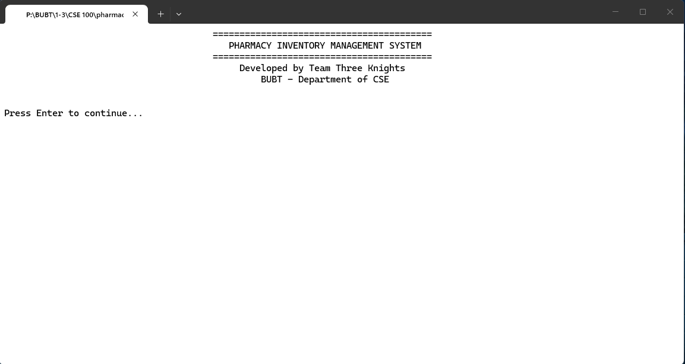 | 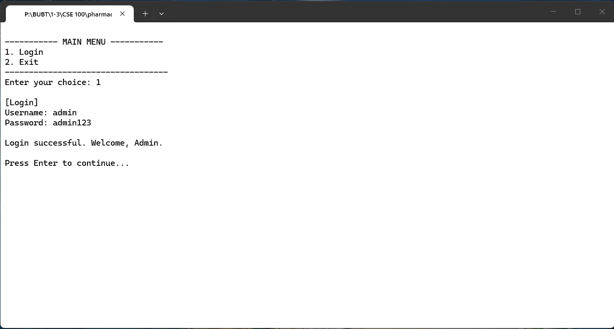 |

| Admin Dashboard |  Add Medicine (Admin) | Sell Medicine 
|---|---|---|
| 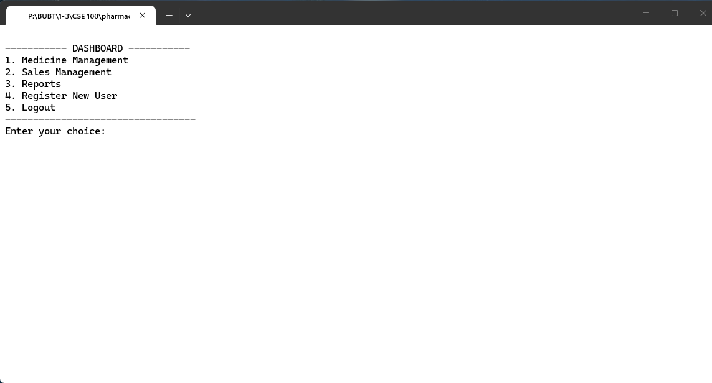 | 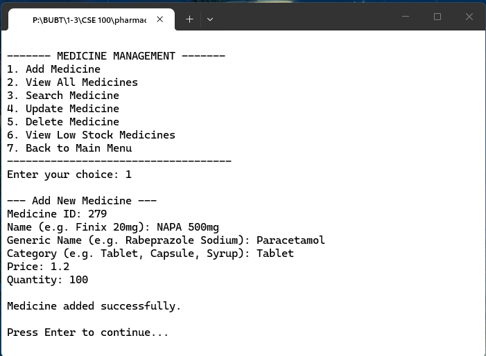 | 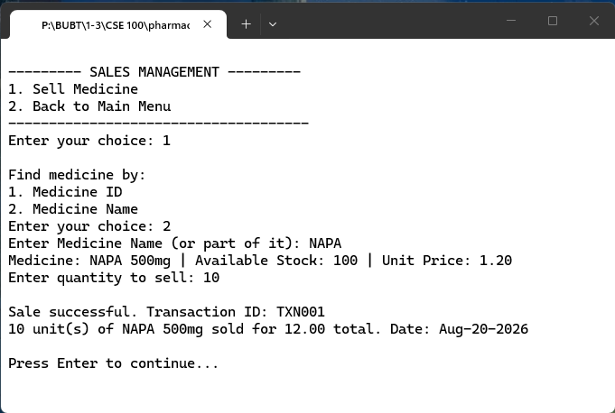 |

| Medicine Management |
|---|
| 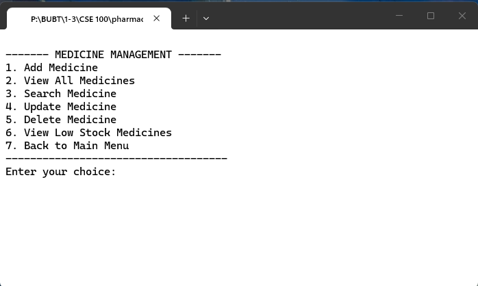 |

| Inventory Report |  Sales Report | Register New User 
|---|---|---|
| 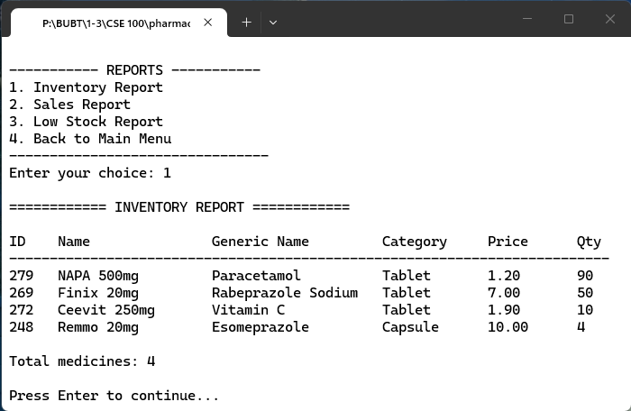 | 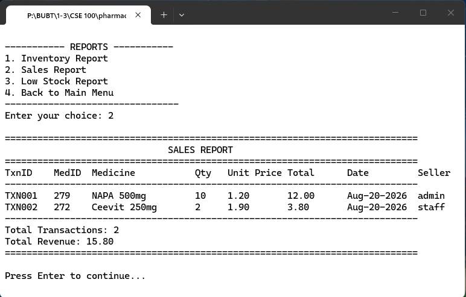 | 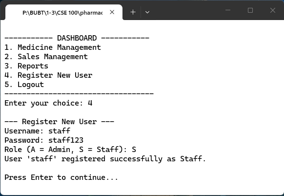 |

| Staff Dashboard |  Add Medicine (Staff, Admin password prompt)  | Sell Medicine 
|---|---|---|
| 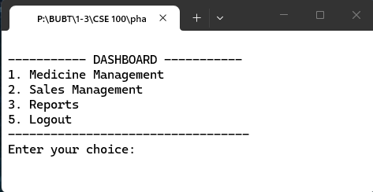 | 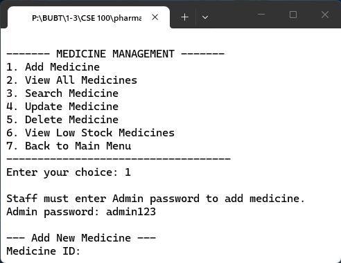 | 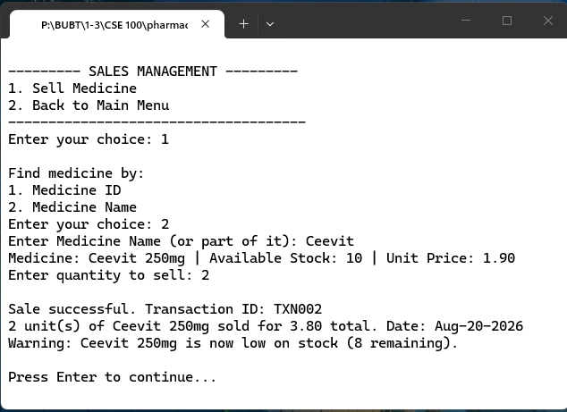 |


---

## 🛠️ Technology Stack

- **Language:** C (C11 standard)
- **Compiler:** GCC (MinGW-w64 on Windows / GCC via apt on Linux)
- **Editor:** Visual Studio Code
- **Storage:** Binary `.dat` files (no external database)
- **Version Control:** Git & GitHub
- **OS:** Windows 10+ / Linux (tested)

---
## 📁 Project Structure
pharmacy-inventory-system/

├── src/

│   ├── main.c

│   ├── auth.c

│   ├── medicine.c

│   ├── inventory.c

│   ├── sales.c

│   └── reports.c

│   └── utils.c

├── include/

│   ├── auth.h

│   ├── medicine.h

│   ├── inventory.h

│   ├── sales.h

│   └── reports.h

│   └── utils.h

├── data/ # Created automatically at runtime (not committed)

│   ├── users.dat

│   ├── medicines.dat

│   └── sales.dat

├── docs/

│   ├── proposal.pdf

│   └── screenshots/

├── .gitignore

└── README.md

---

## ⚙️ How to Compile and Run

### Windows (MinGW/GCC)
```bash
gcc src/*.c -o pharmacy -Iinclude
pharmacy.exe
```

### Linux
```bash
gcc src/*.c -o pharmacy -Iinclude
./pharmacy
```

On first run, the program will prompt you to create the initial Admin account. No default or hardcoded credentials are shipped with the project.

---

## 📌 Development Model

Incremental Development Model — built in 4 increments:

1. Login System + File Structure
2. Medicine Management
3. Inventory & Sales
4. Reports + Integration & Testing

---

## 📄 License

This project is licensed under the MIT License. See [LICENSE](LICENSE) for details.
